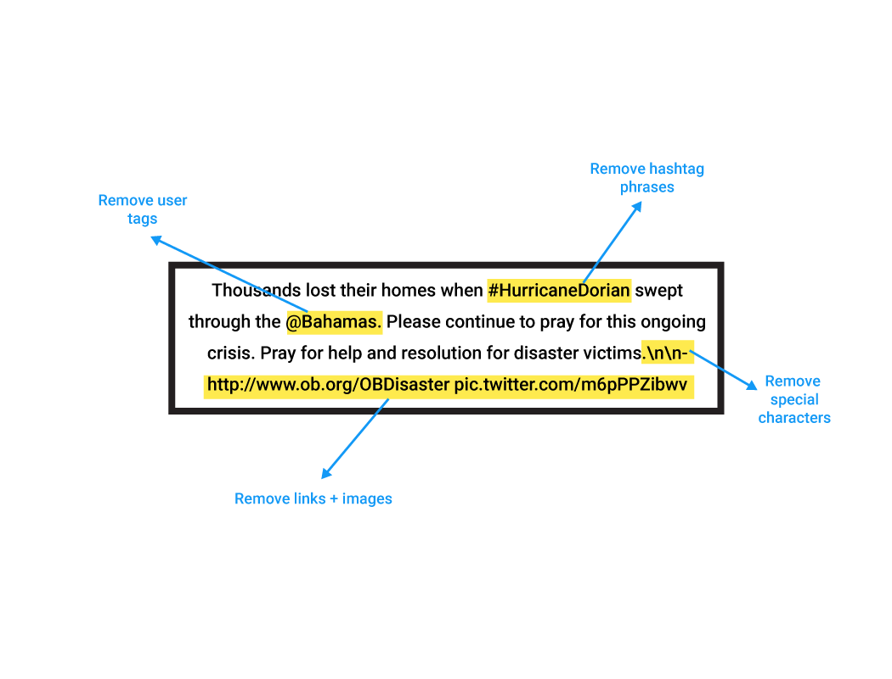
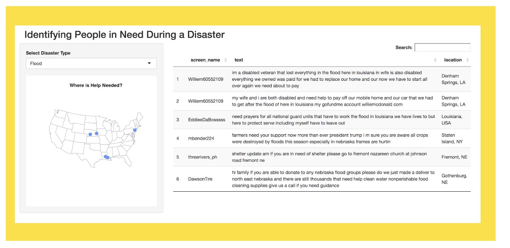

# Identifying People in Need During a Disaster

By [Joshua Kong](https://github.com/joshuakong818), [Brian Tweed](https://github.com/briantweed1), and [Vivian Peng](https://githuhb.com/veeps)

## Executive Summary

In this project, we used natural language processing and classification models to identify whether or not tweet messages during a natural disaster are requesting for help.

---

## Problem Statement

During a natural disaster, it can be challenging to locate where the most urgent needs are. For first responders and organizations providing assistance, it's difficult to locate and triage where help is needed because there isn't a streamlined channel of communication.

Here we considered how might we identify people in need during a disaster, based on their tweets?
---
## Data

For the scope of this pilot, we used Twitter scraper to pull tweets from two types of disasters–hurricanes and fires. For each category, we chose three incidences each and pulled tweets from searching its hashtags. Code for our twitter scrapes can be found here: [Hurricanes](./code/01_data_collection_hurricanes.ipynb) and [Fires](./code/01_fires_data_collection.ipynb)

|Disaster|Hashtag|Dates|
|:---|:---|:---|
|Hurricane Dorian|#hurricanedorian|08-24-2019 to 09-17-2019|
|Hurricane Florence|#hurricaneflorence|08-31-2018 to 09-25-2019|
|Hurricane Maria|#hurricanemaria|09-16-2017 to 10-07-2017|
|Kincade Fire|#kincadefire|10-230-2019 to 11-15-2019|
|Carr Fire|carr fire|07-23-2018 to 09-07-2018|
|Thomas Fire|thomas fire|12-04-2017 to 01-19-2018|

From these Twitter queries, we pulled nearly 80,000 tweets. Cleaning on text data was done [here](./code/002_data_cleaning.ipynb). We used regex to remove hashtags, user tags, links, pictures, and special characters.

---
## EDA

---
## Limitations

---
## Modeling

---
## Dashboard Demo

We envision this model can be useful in real-time disaster relief by:

1. Pull tweets about a disasters
2. Run model to classify tweets in needs
3. Use Twitter API to get user location from the profiles of the tweets that were classified as needing help
4. Use Google maps API to get lattitude/longitude location data
5. First responders can use the dashboard to visualize where help is most needed.

#### [Click to See Demo](https://veeps.shinyapps.io/tweets_disaster_map)

Code for the dashboard can be seen [here](./code/dashboard_code)

---
# Conclusion
